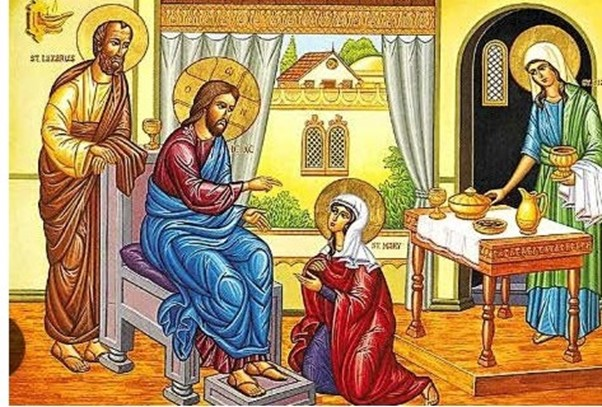

# 教堂通讯

## 圣灵降临节后第六个星期日 2025年7月20日
**路加福音 10:38-42**

在玛莎和玛丽的家里

**诗篇 15:1-3**
> 主啊，谁能寄居你的圣帐？谁能住在你的圣山？就是行为正直，作事公义，心里说实话，舌头不说谗言，不作恶待邻舍，也不毁谤人的。

## 日历
- **圣经学习：** 每周三晚上 7:30，在教堂大厅。  
- **周日崇拜：** 上午9点。欢迎所有人参加。
- **周三圣餐仪式：** 教堂下午 1:30
- **母亲联盟：** 每月第一个星期二下午 12:30
- **英语会话课程：** 周三和周四上午 10 点
- **男士联谊会：** 每月第一个星期五下午 6:30
- **仲冬晚宴：** 7 月 25 日星期五下午 6:30
- **游戏趣味之夜：** 8 月 15 日，晚上 7 点至 9 点

## 通知
- **7 月 25 日教区仲冬晚宴：** 接受预订的截止日期为 7 月 20 日星期日，费用为每人 35澳元（由于参与人数减少，费用有所增加）。
- **安全事工培训模块1：** 所有参与任何事工的志愿者都需要参加此培训。培训时间为7月19日星期六上午10点。
- **感谢所有协助Esther Robinson葬礼的人。**
- **Kerrie 和 Wendy** 请求为 7 月 25 日晚宴抽奖奖品捐款的人能够以现金、实物或知名商店的礼品卡形式捐款。

## 本周日
### 阅读 
创世记 18:1-10a\
诗篇 15\
歌罗西书 1: 15-29\
路加福音 10:38-42

### 赞美诗
1. 破晓时分\
Morning Has Broken

1. 上帝本身就在我们身边\
God Himself is Present

1. 哦，那不会放手的爱\
O Love That Will Not Let Me Go

1. 仁慈的主啊，我们在这里与您面对面\
Here Gracious Lord We See You Face To Face

1. 闪耀，耶稣闪耀\
Shine, Jesus Shine

### 事奉名單
- **读者：** Carole/Muriel
- **祈祷：** Rodney
- **圣杯：** Marilyn
- **欢迎：** Ross  
- **服务：** Marilyn
- **IT：** Mark R/Margaret H
- **PPT：** Wendy Fu

## 下周日
### 读经
创世记 18:20-32\
诗篇 138\
歌罗西书 2:6-15 (16-19)\
路加福音 11:1-13

### 赞美诗
1. 一切希望之主\
Lord of All Hopefulness

1. 愿人都尊祢的名为圣\
Hallowed Be Thy Name

1. 先寻求\
Seek Ye First

1. 耶稣是我们多么好的朋友\
What A Friend We Have In Jesus

1. 寻求，寻求主\
Seek, O Seek The Lord

### 事奉名單
- **读者：** Sue R/Godfred
- **祷告：** Trish
- **圣杯：** Ross
- **欢迎：** Margaret H  
- **服务：** Ross
- **IT：** Brian S/Bob
- **PPT：** Lynne

## 祈祷  
- 为Gail Talbot, Malini Thavasingam 和Bev Thomas祈祷；愿上帝保佑并保护他们和他们的家人，免受一切伤害，并增强他们的身体、思想和精神，从现在到永远。  
- 为 Michelle Veerakoon 的孩子祈祷，5 岁的 Sofia Telegin 和 2 岁的 Archie Telegin希望很快在圣大卫教堂接受洗礼。  
- 全能的上帝，天父，我们赞美您，感谢您多年来希拉里对我们圣大卫堂区所有人忠心耿耿、无私奉献的美好服务。愿您赐予她丰盛的祝福，远超她所求所想，并赐予她未来一切努力的成功。
- 赞美并感谢我们的天父，在 Sue Samuel, Muriel, Myrtle. Petrine and Remy手术和治疗期间及之后对他们的悉心照顾，并在接下来的日子里不断治愈他们，直到他们再次完全康复。
- 赞美并感谢上帝照顾那些身体、精神或灵魂遭受痛苦的人，尤其是Jan Orchard、Ione、Daphne、Arnot、Glenys、Betty、Arlene Nicholas、Jeannie、Esther、Mark、Simon、Valerie、Gail、Susan、Irene、Barbara McFerrin、Bev、Dawn、Mardia 和 Maureen。
- 赞美并感谢上帝，我们的牧师Michelle，她目前正在休長假。请让她恢复活力，继续她在圣大卫穆拉宾的工作。愿她永远平安健康，在您的关爱下安康。

## 七月生日  
- 四日 Jeanette Saunders
- 八日 Wendy Rode
- 十七日 Wendy Wang
- 二十一日 Daphne Amos & Muriel Van Twest
- 二十五 Carl Gilder

## 联系我们
- **电话：** 03 9555 1037 
- **邮箱：** stdavidsmoorabbin@gmail.com
- **地址：**

> 圣大卫穆拉宾圣公会教堂\
> 4 Redholm Street\
> MOORABBIN, Vic 3189\
> AUSTRALIA

## 教会网上奉献
- Bendigo Bank
- BSB：633 108
- Acc：1547 98383
