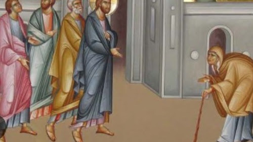

# Church Communication 11th Sunday After Pentecost 24th August 2025  
# 教会通讯：圣灵降临节后第十一主日2025年8月24日  

---

## [Luke 13:10-17](https://www.biblegateway.com/passage/?search=Luke%2013%3A10-17&version=NIV)
## [路加福音 13:10-17](https://www.biblegateway.com/passage/?search=Luke%2013%3A10-17&version=CUVMPS)

## [Hebrews 12:28-29](https://www.biblegateway.com/passage/?search=Hebrews%2012%3A28-29&version=NIV)
## [希伯来书 12:28-29](https://www.biblegateway.com/passage/?search=Hebrews%2012%3A28-29&version=CUVMPS)

> **Therefore, since we are receiving a kingdom that cannot be shaken, let us be thankful,  
> and so worship God acceptably with reverence and awe, for our God is a consuming fire.**  
> **所以我们既得了不能震动的国，就当感恩，照神所喜悦的，用虔诚敬畏的心事奉神，因为我们的神乃是烈火。**

---

## CALENDAR | 日程  

- **Sunday Worship Service: at 09:00 AM. All are welcome.**  
  **主日崇拜：上午9点，欢迎所有人参加。**

- **Wednesday Communion Service: At Church 01:30 PM**  
  **周三圣餐礼：下午1:30，在教堂举行。**

- **Mother’s Union: First Tuesday every month at 12:00 PM**  
  **母亲会：每月第一个星期二中午12点。**

- **English Conversation Classes: Wednesdays and Thursdays at 10:30 AM**  
  **英语会话班：每周三、周四上午10:30。**

- **Men’s Fellowship: First Friday every month at 6 PM**  
  **男子团契：每月第一个星期五下午6点。**

- **Game Fun Night: 15th August, 7 to 9PM**  
  **游戏欢乐夜：8月15日，晚上7点至9点。**

- **Church Fete: Saturday 18th October, 9am to 2pm.**  
  **教会义卖会：10月18日（周六）上午9点至下午2点。**

---

## Notices | 通告  

- **The Church Fete is scheduled for Saturday the 18th October.**  
  **教会义卖会定于10月18日（周六）举行。**

- **The Men’s Fellowship Meeting is on Friday 5th of September at 6pm at the church hall.**  
  **男子团契聚会将于9月5日（周五）下午6点在教堂大厅举行。**

---

## PRAYERS | 祷告  

- **Pray for Michelle Weerakoon’s Children, Sofia (5yrs) and Archie (2yrs), who would like to be baptised at St. David’s shortly.**  
  **请为Michelle Weerakoon的孩子Sofia（5岁）和Archie（2岁）祷告，他们希望近期在圣大卫教堂受洗。**

- **Pray For our upcoming Church Fete; that many will volunteer to make it a success and that God may use it to bring newcomers to His Kingdom.**  
  **为即将举行的教会义卖会祷告，求主感动更多人参与服事，使之成功，也借此吸引更多新朋友进入神的国度。**

- **Pray for peace among warring nations and for healing.**  
  **为交战的国家祈求和平，为医治祈求。**

- **Pray for provision for those in Gaza and other nations without food, that they may not starve and that wealthy nations may give generously.**  
  **求神供应加沙及其他缺乏粮食的国家，让百姓不至饥饿，也感动富裕国家乐于施予。**

- **Praise God for healing Sue Samuel, Myrtle, Petrine, Remy, and others suffering in body, mind, or spirit.**  
  **感谢神医治Sue Samuel、Myrtle、Petrine、Remy，以及所有身心灵受苦的人。**

- **Thank God for caring for Vicar Michelle, Jeff, family, and Vicars Rick & Jessica Cheung during their ministry at St. David’s.**  
  **感谢神看顾牧师Michelle、Jeff及家人，也感谢祂赐福Rick与Jessica Cheung牧师在圣大卫的事工。**

---

## Birthdays In August | 八月生日  

**2nd Betty Ketels, 3rd Simon, 13th Dawn Crozier, 14th Quin Hua Yang, 15th Barbara Mcferran, 27th Mary Haworth, 30th Harriet Maas.**  
**2日 Betty Ketels，3日 Simon，13日 Dawn Crozier，14日 Quin Hua Yang，15日 Barbara Mcferran，27日 Mary Haworth，30日 Harriet Maas。**

---

## Contact | 联系方式  

**Tel: 03 9555 1037**  
**Email: stdavidsmoorabbin@gmail.com**  

**Church Online Giving:**  
**Bendigo Bank BSB: 633 108 AC: 1547 98383**  
**网络奉献：Bendigo Bank BSB: 633 108 账号: 1547 98383**

---
